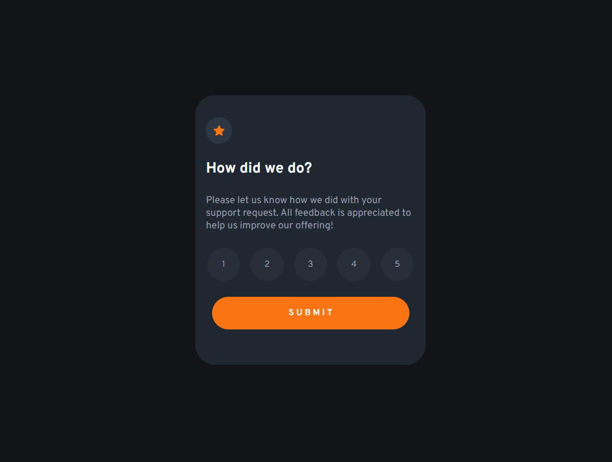

# Frontend Mentor - Interactive rating component solution

This is a solution to the [Interactive rating component challenge on Frontend Mentor](https://www.frontendmentor.io/challenges/interactive-rating-component-koxpeBUmI). Frontend Mentor challenges help you improve your coding skills by building realistic projects. 

## Table of contents

- [Overview](#overview)
  - [The challenge](#the-challenge)
  - [Screenshot](#screenshot)
- [My process](#my-process)
  - [Built with](#built-with)  
- [Author](#author)

## Overview
An interactive rating component is a user interface element that allows users to rate a product or service on a numerical or star-based scale. It is commonly used on websites and mobile applications to gather feedback from users about their experience with a particular product or service.

Interactive rating components typically display a set of stars or other icons that represent different rating levels, such as 1 to 5 stars. Users can click or tap on a rating level to indicate their level of satisfaction with the product or service, and their selection is usually highlighted or animated to provide visual feedback

### The challenge

Users should be able to:

- View the optimal layout for the app depending on their device's screen size
- See hover states for all interactive elements on the page
- Select and submit a number rating
- See the "Thank you" card state after submitting a rating

### Screenshot

### Links

- Solution URL: [Interactive_rating_component](https://github.com/Shiba-Tatsuya/interactive_rating_component)
- Live Site URL: [site URL](https://shiba-tatsuya.github.io/interactive_rating_component/)

## My process
I created two different cards one for rating and another for saying thank you.When the submit button is clicked rating card's display property will be switched to none and another card's display property will be switched to display using Eventhandler in Javascript.

### Built with

- Semantic HTML5 markup
- CSS custom properties
- Flexbox
- Javascript

## Author

- Frontend Mentor - [@Shiba-Tatsuya](https://www.frontendmentor.io/profile/Shiba-Tatsuya)

